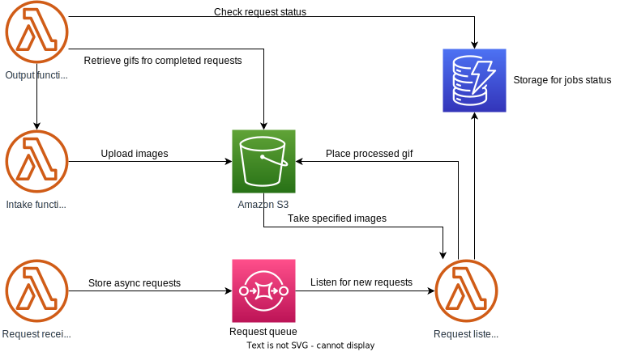

# All things aws-serverless-workshop

Workshop brought to you by me, [Tornike](https://github.com/tokotokosd) and [Goga]()

Idea is to build microservice framwork that will use several lambdas dynamodb for config coordination and S3 for storage.

## Make a GIF

### Components
- Image intake (maybe crawl internet to get random images for random GIF)
- GIF generator (spit out GIF based on request: by indexes or random. puts it in output s3)
- Request intake (put request config in dynamodb or maybe SQS, spit out req id)
- Result getter (take output GIF based on request id)

## Service architecture

